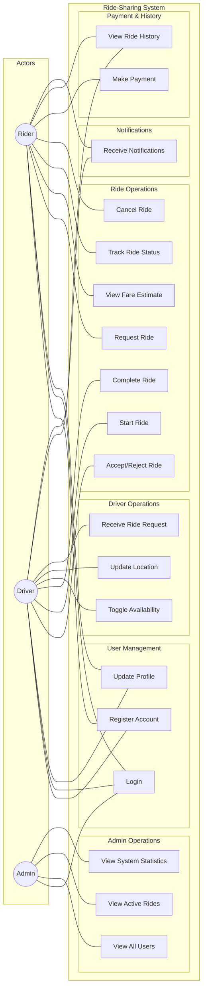
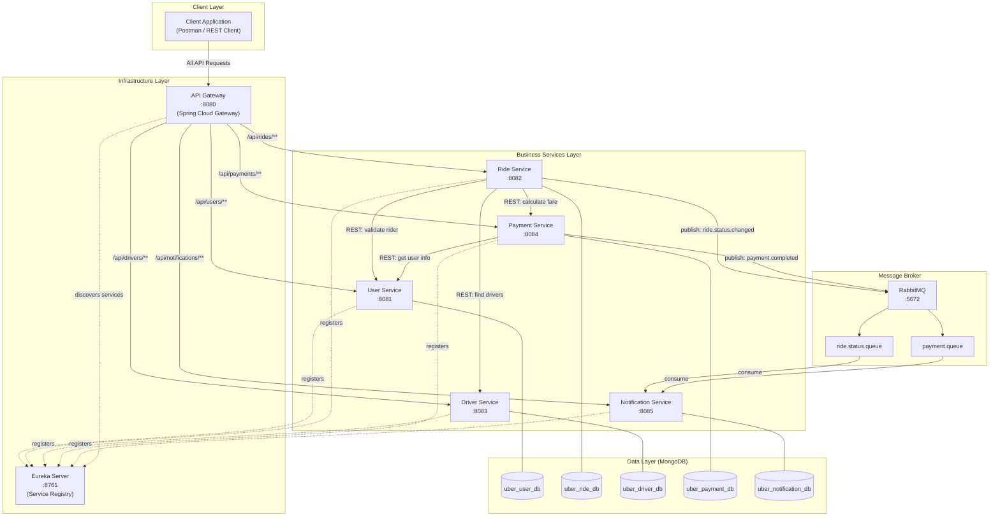
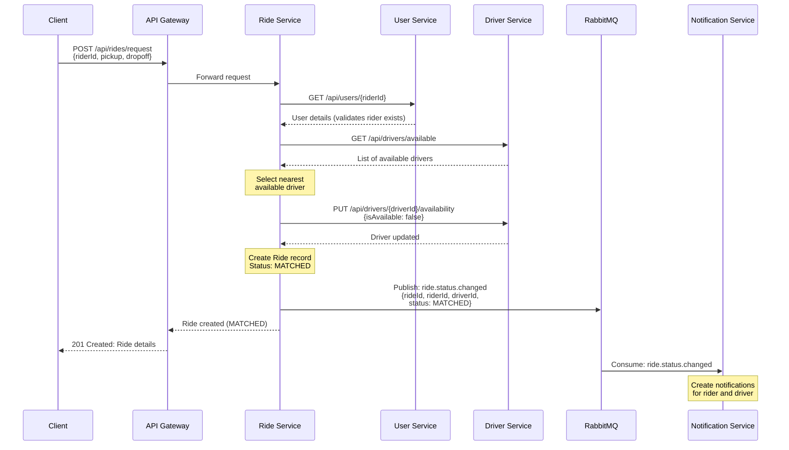
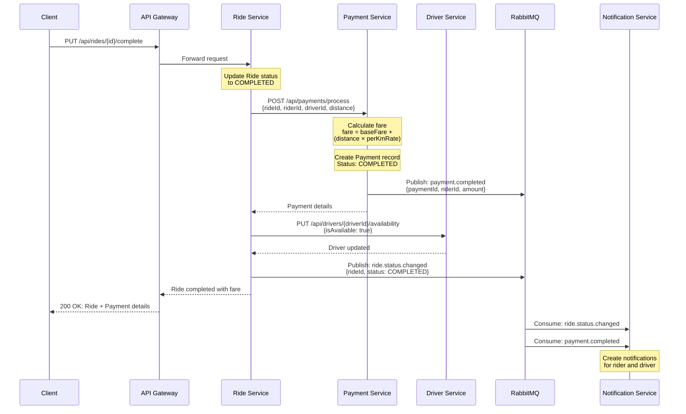
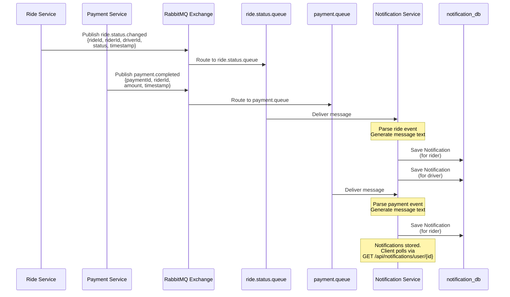

# SWE 4602: Software Design and Architectures

**Semester:** Summer 2024-25

---

## Project Report

### Spring Boot Microservice Project
### Ride-Sharing App: Uber

---

**Group-B, Team-X**

| # | Name | ID |
|---|------|----|
| 1 | Tahir Zaman Umar | 220042134 |
| 2 | Naybur Rahman Sinha | 220042128 |
| 3 | Raiyan Muhtasim | 220042162 |
| 4 | Hasibul Karim | 220042102 |

---

## 1. Introduction

### 1.1 The Idea

Ride-sharing platforms like Uber have revolutionized urban transportation by connecting riders who need a ride with drivers who can provide one — all through a seamless digital experience. For this project, we design and build a simplified yet functionally representative ride-sharing application modeled after Uber, using a **microservices architecture** with **Spring Boot**.

The project focuses on capturing the essential workflows of a ride-sharing system — user registration, ride requesting, driver matching, real-time ride tracking, fare calculation, and notifications — while keeping the scope achievable for a team of four undergraduate students within a 3-4 week timeframe.

### 1.2 Motivation

The choice of a ride-sharing application is motivated by:

- **Rich domain complexity**: The system naturally decomposes into multiple bounded contexts (users, rides, drivers, payments, notifications), making it an excellent candidate for microservices architecture.
- **Real-world relevance**: Uber-like systems are widely understood, making design decisions intuitive and the project demonstrable.
- **Diverse communication patterns**: The system requires both synchronous (REST) and asynchronous (message queue) inter-service communication, showcasing multiple architectural patterns.
- **Scalability concerns**: Different parts of the system have different scaling needs (e.g., ride matching vs. user registration), naturally justifying the microservice decomposition.

---

## 2. Project Description

### 2.1 Overview

The application is a **ride-sharing platform** that allows passengers (riders) to request rides and get matched with nearby available drivers. The system handles the complete ride lifecycle — from requesting a ride, through driver matching and ride tracking, to fare calculation and payment processing.

The system is designed following the **microservices architecture pattern**, where each core business capability is encapsulated in an independently deployable service. Services communicate via REST APIs for synchronous operations and RabbitMQ message broker for asynchronous event-driven communication.

### 2.2 Scope

The project covers the following functional areas:

| Area | In Scope | Out of Scope |
|------|----------|--------------|
| User Management | Registration, login, profile management for riders and drivers | OAuth/SSO, social login |
| Ride Management | Ride request, driver matching, status tracking | Real-time GPS tracking, route optimization |
| Driver Management | Availability toggle, location updates, ride accept/reject | Background location services, driver onboarding docs |
| Payment | Fare calculation, simulated payment processing | Real payment gateway integration, refunds |
| Notifications | Ride status updates via async messaging | Push notifications, SMS/email delivery |
| Infrastructure | API Gateway, Service Registry (Eureka), health checks | Containerization (Docker/K8s), CI/CD |

### 2.3 Key Features

1. **Rider Features**
   - Register and manage profile
   - Request a ride by specifying pickup and drop-off locations
   - View ride status in real-time (requested → matched → in-progress → completed)
   - View fare estimate before confirming a ride
   - View ride history

2. **Driver Features**
   - Register and manage driver profile
   - Toggle availability status (online/offline)
   - Receive and accept/reject ride requests
   - Update current location
   - View earnings and ride history

3. **Admin Features**
   - View all users (riders and drivers)
   - Monitor active rides
   - View system-wide statistics

4. **System Features**
   - Centralized API Gateway for routing and single entry point
   - Service discovery and registration via Eureka
   - Asynchronous event-driven notifications via RabbitMQ
   - Health monitoring via Spring Actuator
   - Per-service MongoDB databases (database-per-service pattern)

### 2.4 Target Users

| Actor | Description |
|-------|-------------|
| **Rider** | A passenger who uses the app to request and take rides |
| **Driver** | A vehicle owner who offers ride services through the platform |
| **Admin** | A system administrator who monitors and manages the platform |

---

## 3. Actors, Use Cases & Use Case Diagram

### 3.1 Actors

| Actor | Type | Description |
|-------|------|-------------|
| **Rider** | Primary | End-user who requests rides, views ride status, and makes payments |
| **Driver** | Primary | Service provider who accepts ride requests and completes trips |
| **Admin** | Primary | Platform administrator who oversees system operations |
| **System (Automated)** | Secondary | Background processes such as driver matching, fare calculation, and notification dispatch |

### 3.2 Use Cases

#### 3.2.1 Rider Use Cases

| ID | Use Case | Description |
|----|----------|-------------|
| UC-R01 | Register Account | Rider creates a new account with name, email, phone, and password |
| UC-R02 | Login | Rider authenticates using email and password |
| UC-R03 | Update Profile | Rider updates personal information |
| UC-R04 | Request Ride | Rider submits a ride request with pickup and drop-off locations |
| UC-R05 | View Fare Estimate | Rider views estimated fare before confirming ride |
| UC-R06 | Track Ride Status | Rider views current ride status (requested, matched, in-progress, completed) |
| UC-R07 | Cancel Ride | Rider cancels a pending or matched ride |
| UC-R08 | View Ride History | Rider views past completed rides |
| UC-R09 | Make Payment | Rider completes payment for a completed ride |
| UC-R10 | Receive Notifications | Rider receives async notifications about ride status changes |

#### 3.2.2 Driver Use Cases

| ID | Use Case | Description |
|----|----------|-------------|
| UC-D01 | Register as Driver | Driver creates an account with vehicle details |
| UC-D02 | Login | Driver authenticates using email and password |
| UC-D03 | Update Profile | Driver updates personal and vehicle information |
| UC-D04 | Toggle Availability | Driver switches between online (available) and offline status |
| UC-D05 | Update Location | Driver sends current location coordinates to the system |
| UC-D06 | Receive Ride Request | Driver receives a notification about a new ride request nearby |
| UC-D07 | Accept/Reject Ride | Driver accepts or rejects an assigned ride request |
| UC-D08 | Start Ride | Driver marks ride as in-progress when passenger is picked up |
| UC-D09 | Complete Ride | Driver marks ride as completed at drop-off |
| UC-D10 | View Ride History | Driver views past completed rides and earnings |
| UC-D11 | Receive Notifications | Driver receives async notifications about ride assignments and updates |

#### 3.2.3 Admin Use Cases

| ID | Use Case | Description |
|----|----------|-------------|
| UC-A01 | Login | Admin authenticates with admin credentials |
| UC-A02 | View All Users | Admin views list of all registered riders and drivers |
| UC-A03 | View Active Rides | Admin monitors currently active rides |
| UC-A04 | View System Statistics | Admin views system-wide metrics (total rides, active drivers, revenue) |

### 3.3 Use Case Diagram



---

## 4. Microservices Inventory (Complete List)

In a production-grade ride-sharing system like Uber, the following microservices would be necessary for smooth operation. Each is justified as a separate, independently deployable service based on the principles of **single responsibility**, **independent scalability**, and **bounded context** from Domain-Driven Design (DDD).

### 4.1 Complete Service Catalog

| # | Microservice | Domain | Implemented? |
|---|-------------|--------|:------------:|
| 1 | User Service | Identity & Access | ✅ Yes |
| 2 | Ride Service | Ride Management | ✅ Yes |
| 3 | Driver Service | Driver Management | ✅ Yes |
| 4 | Payment Service | Billing & Finance | ✅ Yes |
| 5 | Notification Service | Communication | ✅ Yes |
| 6 | API Gateway | Infrastructure | ✅ Yes |
| 7 | Service Registry (Eureka) | Infrastructure | ✅ Yes |
| 8 | Location/Mapping Service | Geospatial | ❌ No |
| 9 | Pricing/Surge Service | Dynamic Pricing | ❌ No |
| 10 | Rating & Review Service | Feedback | ❌ No |
| 11 | Chat/Support Service | Customer Support | ❌ No |
| 12 | Analytics Service | Business Intelligence | ❌ No |
| 13 | Promo/Coupon Service | Marketing | ❌ No |
| 14 | Trip History/Reporting Service | Reporting | ❌ No |
| 15 | Authentication/Authorization Service | Security | ❌ No |

### 4.2 Justifications for Separate Microservices

#### 1. User Service
- **Responsibility**: Manages rider and driver registration, authentication, and profile data.
- **Why separate?**: User management has a distinct data model and lifecycle from ride operations. It is a low-frequency, high-consistency service — users register once but ride frequently. Decoupling it allows independent scaling and deployment without affecting ride-critical services.

#### 2. Ride Service
- **Responsibility**: Handles the entire ride lifecycle — ride requests, driver matching, status transitions (REQUESTED → MATCHED → IN_PROGRESS → COMPLETED → CANCELLED).
- **Why separate?**: This is the **core business domain** of the platform. It has the highest complexity and most state transitions. It must scale independently during peak hours (e.g., rush hour, events) and has its own bounded context with ride-specific data models.

#### 3. Driver Service
- **Responsibility**: Manages driver-specific operations — availability toggling, location updates, vehicle information, and driver-side ride management.
- **Why separate?**: Drivers have a fundamentally different interaction pattern than riders. Location updates are high-frequency writes (potentially every few seconds), requiring a service optimized for write-heavy workloads. Driver availability and location are separate concerns from the ride lifecycle itself.

#### 4. Payment Service
- **Responsibility**: Handles fare calculation, payment processing, and transaction records.
- **Why separate?**: Payment processing involves financial data with strict consistency requirements. In production, this service would integrate with external payment gateways (Stripe, PayPal) and must comply with financial regulations (PCI-DSS). Isolating it prevents financial logic from coupling with ride operations and allows independent security auditing.

#### 5. Notification Service
- **Responsibility**: Sends asynchronous notifications to riders and drivers about ride status changes, payment confirmations, and system events.
- **Why separate?**: Notifications are inherently **asynchronous and fire-and-forget**. They should never block ride or payment operations. Using a message broker (RabbitMQ), this service consumes events from other services and processes them independently. It can be scaled based on notification volume without affecting core services.

#### 6. API Gateway
- **Responsibility**: Single entry point for all client requests. Handles request routing, load distribution, and cross-cutting concerns.
- **Why separate?**: The gateway decouples clients from the internal microservice topology. Clients need not know individual service addresses. It also provides a centralized place for rate limiting, request logging, and CORS configuration.

#### 7. Service Registry (Eureka Server)
- **Responsibility**: Service discovery and registration. All microservices register with Eureka and discover other services through it.
- **Why separate?**: This is a critical **infrastructure service** that enables dynamic service discovery. Without it, services would need hardcoded addresses, defeating the purpose of microservices. It must run independently to remain available even when business services are restarting.

#### 8. Location/Mapping Service (Not Implemented)
- **Responsibility**: Would handle geocoding, reverse geocoding, distance calculation, ETA estimation, and route optimization.
- **Why separate?**: Geospatial computations are CPU-intensive and require specialized data structures (spatial indices). In production, this would integrate with mapping APIs (Google Maps, Mapbox) and needs to scale independently from ride logic.

#### 9. Pricing/Surge Service (Not Implemented)
- **Responsibility**: Would implement dynamic (surge) pricing based on demand-supply ratios, time of day, and route distance.
- **Why separate?**: Pricing algorithms are complex, data-driven, and change frequently. Keeping pricing in a separate service allows A/B testing of pricing strategies and independent deployment of pricing model updates without touching ride logic.

#### 10. Rating & Review Service (Not Implemented)
- **Responsibility**: Would manage post-ride ratings and reviews for both riders and drivers.
- **Why separate?**: Ratings have their own data model and access patterns (read-heavy, eventually consistent). They influence driver matching algorithms but don't need to be processed in real-time during a ride.

#### 11. Chat/Support Service (Not Implemented)
- **Responsibility**: Would provide in-app messaging between rider and driver, and customer support ticket management.
- **Why separate?**: Real-time messaging requires WebSocket connections and has entirely different scaling characteristics (persistent connections vs. request-response). It needs its own infrastructure and data store.

#### 12. Analytics Service (Not Implemented)
- **Responsibility**: Would aggregate and process data for business intelligence — ride trends, revenue reports, driver utilization, and operational metrics.
- **Why separate?**: Analytics involves heavy read queries on aggregated data. Running analytical queries on operational databases degrades performance. A separate service with its own read-optimized data store prevents this contention.

#### 13. Promo/Coupon Service (Not Implemented)
- **Responsibility**: Would manage promotional offers, discount coupons, and referral programs.
- **Why separate?**: Marketing promotions have their own lifecycle (creation, activation, expiration) and business rules that change frequently. Decoupling from payment allows independent marketing campaigns without risking payment stability.

#### 14. Trip History/Reporting Service (Not Implemented)
- **Responsibility**: Would store and serve historical trip data, generate reports, and provide data export capabilities.
- **Why separate?**: Historical data grows indefinitely and needs different storage strategies (archival, compression). Separating it from active ride data keeps the Ride Service performant and allows different retention policies.

#### 15. Authentication/Authorization Service (Not Implemented)
- **Responsibility**: Would handle JWT token generation, validation, role-based access control, and session management as a dedicated identity provider.
- **Why separate?**: In production, authentication is a cross-cutting concern that every service depends on. A dedicated auth service (or integration with Keycloak/Auth0) centralizes security policy enforcement and token management.

---

## 5. Chosen Microservices for Implementation

From the complete catalog, we selected **5 business microservices** and **2 infrastructure services** for implementation. This selection provides a **practical, end-to-end ride-sharing workflow** while remaining achievable for a 4-person team in 3-4 weeks.

### 5.1 Selection Rationale

| Criteria | How It Influenced Selection |
|----------|-----------------------------|
| **End-to-end coverage** | Selected services cover the complete ride lifecycle: register → request ride → match driver → complete ride → pay → notify |
| **Communication diversity** | Demonstrates both synchronous (REST) and asynchronous (RabbitMQ) patterns |
| **Complexity balance** | Each service is non-trivial but not overwhelming for undergrad implementation |
| **Infrastructure showcase** | API Gateway + Eureka demonstrate real microservice infrastructure patterns |
| **Time constraint** | 5 business services ÷ 4 team members = ~1.25 services per person (manageable) |

### 5.2 Service Port Assignments

| Service | Port | Type |
|---------|------|------|
| Eureka Server | 8761 | Infrastructure |
| API Gateway | 8080 | Infrastructure |
| User Service | 8081 | Business |
| Ride Service | 8082 | Business |
| Driver Service | 8083 | Business |
| Payment Service | 8084 | Business |
| Notification Service | 8085 | Business |
| RabbitMQ | 5672 / 15672 | Message Broker |
| MongoDB | 27017 | Database |

### 5.3 Detailed Service Specifications

---

#### 5.3.1 User Service (Port 8081)

**Responsibility**: Manages registration, authentication, and profile operations for all users (riders, drivers, admins).

**Database**: `uber_user_db` (MongoDB)

**Data Model**:
```
User {
    id: String (MongoDB ObjectId)
    name: String
    email: String (unique)
    password: String (hashed)
    phone: String
    role: Enum [RIDER, DRIVER, ADMIN]
    createdAt: DateTime
    updatedAt: DateTime
}
```

**REST API Endpoints**:

| Method | Endpoint | Description |
|--------|----------|-------------|
| POST | `/api/users/register` | Register a new user |
| POST | `/api/users/login` | Authenticate user |
| GET | `/api/users/{id}` | Get user profile by ID |
| PUT | `/api/users/{id}` | Update user profile |
| GET | `/api/users` | Get all users (admin) |
| GET | `/api/users/role/{role}` | Get users by role |

**Inter-service Communication**:
- Called by: Ride Service (to validate rider), Driver Service (to validate driver), Payment Service (to get user details)
- Communication type: Synchronous REST

---

#### 5.3.2 Ride Service (Port 8082)

**Responsibility**: Core service managing the entire ride lifecycle — from ride request through driver matching to ride completion.

**Database**: `uber_ride_db` (MongoDB)

**Data Model**:
```
Ride {
    id: String (MongoDB ObjectId)
    riderId: String (ref: User)
    driverId: String (ref: User, nullable until matched)
    pickupLocation: String
    dropoffLocation: String
    status: Enum [REQUESTED, MATCHED, IN_PROGRESS, COMPLETED, CANCELLED]
    fareEstimate: Double
    finalFare: Double
    requestedAt: DateTime
    matchedAt: DateTime
    startedAt: DateTime
    completedAt: DateTime
}
```

**REST API Endpoints**:

| Method | Endpoint | Description |
|--------|----------|-------------|
| POST | `/api/rides/request` | Request a new ride |
| GET | `/api/rides/{id}` | Get ride details |
| PUT | `/api/rides/{id}/match` | Match a driver to the ride |
| PUT | `/api/rides/{id}/start` | Start the ride (driver picked up rider) |
| PUT | `/api/rides/{id}/complete` | Complete the ride |
| PUT | `/api/rides/{id}/cancel` | Cancel the ride |
| GET | `/api/rides/rider/{riderId}` | Get ride history for a rider |
| GET | `/api/rides/driver/{driverId}` | Get ride history for a driver |
| GET | `/api/rides/active` | Get all currently active rides |

**Inter-service Communication**:
- Calls: User Service (validate rider), Driver Service (find available drivers, update driver status)
- Publishes to RabbitMQ: `ride.status.changed` event (consumed by Notification Service)
- Calls: Payment Service (trigger fare calculation on ride completion)
- Communication types: Synchronous REST + Asynchronous RabbitMQ

---

#### 5.3.3 Driver Service (Port 8083)

**Responsibility**: Manages driver-specific operations including availability status, location tracking, and vehicle information.

**Database**: `uber_driver_db` (MongoDB)

**Data Model**:
```
DriverProfile {
    id: String (MongoDB ObjectId)
    userId: String (ref: User)
    vehicleModel: String
    vehiclePlate: String
    vehicleColor: String
    isAvailable: Boolean
    currentLatitude: Double
    currentLongitude: Double
    totalRides: Integer
    rating: Double
    updatedAt: DateTime
}
```

**REST API Endpoints**:

| Method | Endpoint | Description |
|--------|----------|-------------|
| POST | `/api/drivers/profile` | Create driver profile |
| GET | `/api/drivers/{userId}` | Get driver profile |
| PUT | `/api/drivers/{userId}` | Update driver profile |
| PUT | `/api/drivers/{userId}/availability` | Toggle availability |
| PUT | `/api/drivers/{userId}/location` | Update current location |
| GET | `/api/drivers/available` | Get all available drivers |
| GET | `/api/drivers/nearby` | Get available drivers near a location |

**Inter-service Communication**:
- Called by: Ride Service (find available drivers, update availability after matching)
- Calls: User Service (validate driver user exists)
- Communication type: Synchronous REST

---

#### 5.3.4 Payment Service (Port 8084)

**Responsibility**: Handles fare calculation based on distance and payment processing (simulated). Records all transactions.

**Database**: `uber_payment_db` (MongoDB)

**Data Model**:
```
Payment {
    id: String (MongoDB ObjectId)
    rideId: String (ref: Ride)
    riderId: String (ref: User)
    driverId: String (ref: User)
    amount: Double
    status: Enum [PENDING, COMPLETED, FAILED, REFUNDED]
    paymentMethod: String (default: "CASH")
    createdAt: DateTime
    completedAt: DateTime
}
```

**Fare Calculation Logic** (simplified):
```
baseFare = 50.0
perKmRate = 15.0
fare = baseFare + (distance * perKmRate)
```
> *Note: Distance will be simulated using a simple calculation since real GPS/mapping integration is out of scope.*

**REST API Endpoints**:

| Method | Endpoint | Description |
|--------|----------|-------------|
| POST | `/api/payments/calculate` | Calculate fare for a ride |
| POST | `/api/payments/process` | Process payment for a completed ride |
| GET | `/api/payments/{id}` | Get payment details |
| GET | `/api/payments/ride/{rideId}` | Get payment for a specific ride |
| GET | `/api/payments/rider/{riderId}` | Get payment history for a rider |
| GET | `/api/payments/driver/{driverId}` | Get earnings for a driver |

**Inter-service Communication**:
- Called by: Ride Service (calculate fare, process payment on ride completion)
- Calls: User Service (validate rider/driver)
- Publishes to RabbitMQ: `payment.completed` event (consumed by Notification Service)
- Communication types: Synchronous REST + Asynchronous RabbitMQ

---

#### 5.3.5 Notification Service (Port 8085)

**Responsibility**: Consumes events from RabbitMQ and processes notifications for ride status changes and payment confirmations. Logs notifications (simulates delivery).

**Database**: `uber_notification_db` (MongoDB)

**Data Model**:
```
Notification {
    id: String (MongoDB ObjectId)
    userId: String (ref: User)
    type: Enum [RIDE_REQUESTED, RIDE_MATCHED, RIDE_STARTED, RIDE_COMPLETED, RIDE_CANCELLED, PAYMENT_COMPLETED]
    message: String
    isRead: Boolean
    createdAt: DateTime
}
```

**RabbitMQ Queues Consumed**:

| Queue | Event | Action |
|-------|-------|--------|
| `ride.status.queue` | `ride.status.changed` | Creates notification for rider and driver about ride status change |
| `payment.queue` | `payment.completed` | Creates notification for rider about successful payment |

**REST API Endpoints**:

| Method | Endpoint | Description |
|--------|----------|-------------|
| GET | `/api/notifications/user/{userId}` | Get all notifications for a user |
| GET | `/api/notifications/user/{userId}/unread` | Get unread notifications |
| PUT | `/api/notifications/{id}/read` | Mark notification as read |

**Inter-service Communication**:
- Consumes from RabbitMQ: `ride.status.changed`, `payment.completed` events
- Communication type: Asynchronous RabbitMQ (consumer only)

---

#### 5.3.6 API Gateway (Port 8080)

**Responsibility**: Single entry point for all client requests. Routes requests to appropriate backend services discovered via Eureka.

**Key Configuration**:
- Built with **Spring Cloud Gateway**
- Integrates with **Eureka** for dynamic service discovery
- Routes are configured to forward requests based on URL path prefixes

**Route Mapping**:

| Path Pattern            | Target Service       |
| ----------------------- | -------------------- |
| `/api/users/**`         | user-service         |
| `/api/rides/**`         | ride-service         |
| `/api/drivers/**`       | driver-service       |
| `/api/payments/**`      | payment-service      |
| `/api/notifications/**` | notification-service |

---

#### 5.3.7 Service Registry — Eureka Server (Port 8761)

**Responsibility**: Netflix Eureka-based service registry. All microservices register themselves at startup and discover other services through the registry.

**Key Features**:
- Service registration and heartbeat monitoring
- Service discovery via service name lookup
- Dashboard at `http://localhost:8761` for monitoring registered services
- Self-preservation mode for network partition tolerance

---

## 6. System Architecture Diagram

The following diagram illustrates the high-level architecture of the ride-sharing system, showing how clients interact with the API Gateway, how services discover each other through Eureka, and how asynchronous communication flows through RabbitMQ.



### 6.1 Architecture Patterns Used

| Pattern | Implementation | Purpose |
|---------|---------------|---------|
| **API Gateway** | Spring Cloud Gateway | Single entry point, request routing, cross-cutting concerns |
| **Service Registry** | Netflix Eureka | Dynamic service discovery, eliminates hardcoded URLs |
| **Database per Service** | Separate MongoDB databases | Data isolation, independent schema evolution, loose coupling |
| **Asynchronous Messaging** | RabbitMQ | Event-driven notification delivery, decoupled communication |
| **Synchronous REST** | Spring WebClient / RestTemplate | Direct request-response for data queries and validations |

---

## 7. Microservice Interaction & Data Flow

This section details how the microservices communicate with each other, what data flows between them, and the sequence of interactions for key business workflows.

### 7.1 Communication Patterns Overview

The system uses two communication patterns:

| Pattern | Technology | Use Case | Characteristics |
|---------|-----------|----------|-----------------|
| **Synchronous REST** | Spring WebClient | Service-to-service data queries, validations, CRUD operations | Request-response, blocking, immediate consistency |
| **Asynchronous Messaging** | RabbitMQ (AMQP) | Event notifications, fire-and-forget operations | Non-blocking, eventually consistent, decoupled |

### 7.2 Inter-Service Communication Map

| Source Service | Target Service | Method | Data Exchanged | Purpose |
|---------------|---------------|--------|----------------|---------|
| Ride Service | User Service | REST GET | userId → User details | Validate rider exists |
| Ride Service | Driver Service | REST GET | location → List of drivers | Find available drivers nearby |
| Ride Service | Driver Service | REST PUT | driverId, availability status | Update driver availability after matching |
| Ride Service | Payment Service | REST POST | rideId, distance | Calculate fare estimate |
| Ride Service | RabbitMQ | AMQP Publish | rideId, riderId, driverId, status, message | Notify about ride status change |
| Payment Service | User Service | REST GET | userId → User details | Get rider/driver info for payment record |
| Payment Service | RabbitMQ | AMQP Publish | paymentId, riderId, amount, status | Notify about payment completion |
| Notification Service | RabbitMQ | AMQP Consume | Event payload (rideId/paymentId, userId, message) | Create and store notifications |
| API Gateway | All Services | REST (Proxy) | Client request → Service response | Route and forward requests |
| All Services | Eureka | HTTP (Heartbeat) | Service name, host, port, status | Register and maintain service registry |

### 7.3 Data Flow Diagrams

#### 7.3.1 Flow 1: Ride Request & Driver Matching

This sequence shows the complete flow when a rider requests a ride and gets matched with a driver.



#### 7.3.2 Flow 2: Ride Completion & Payment

This sequence shows what happens when a driver completes a ride and payment is processed.



#### 7.3.3 Flow 3: Notification Processing (Async)

This diagram details the asynchronous notification flow through RabbitMQ.



### 7.4 RabbitMQ Configuration Summary

| Component   | Name                  | Purpose                                       |
| ----------- | --------------------- | --------------------------------------------- |
| Exchange    | `uber.exchange`       | Topic exchange for routing events             |
| Routing Key | `ride.status.changed` | Routes ride status events                     |
| Routing Key | `payment.completed`   | Routes payment events                         |
| Queue       | `ride.status.queue`   | Receives ride status change events            |
| Queue       | `payment.queue`       | Receives payment completion events            |
| Consumer    | Notification Service  | Listens on both queues, creates notifications |

---

## 8. Tech Stack

### 8.1 Technology Summary

| Category              | Technology                    | Purpose                                    |
| --------------------- | ----------------------------- | ------------------------------------------ |
| **Language**          | Java                          | Primary programming language               |
| **Framework**         | Spring Boot                   | Application framework for microservices    |
| **API Gateway**       | Spring Cloud Gateway          | Request routing and single entry point     |
| **Service Discovery** | Netflix Eureka (Spring Cloud) | Service registration and discovery         |
| **Database**          | MongoDB                       | NoSQL document database (per-service)      |
| **Message Broker**    | RabbitMQ                      | Asynchronous event-driven messaging        |
| **IDE**               | IntelliJ IDEA Ultimate        | Development environment                    |
| **Build Tool**        | Maven                         | Dependency management and build automation |
| **API Testing**       | Postman                       | REST API testing and documentation         |
| **Health Monitoring** | Spring Boot Actuator          | Service health checks and metrics          |

### 8.2 Spring Boot Dependencies (per service)

| Dependency           | Artifact ID                                  | Purpose                                            |
| -------------------- | -------------------------------------------- | -------------------------------------------------- |
| Spring Web           | `spring-boot-starter-web`                    | REST API controllers                               |
| Spring Data MongoDB  | `spring-boot-starter-data-mongodb`           | MongoDB integration                                |
| Eureka Client        | `spring-cloud-starter-netflix-eureka-client` | Service registry integration                       |
| Spring AMQP          | `spring-boot-starter-amqp`                   | RabbitMQ integration (Ride, Payment, Notification) |
| Spring Actuator      | `spring-boot-starter-actuator`               | Health checks and monitoring                       |
| Lombok               | `lombok`                                     | Boilerplate code reduction                         |
| Spring Cloud Gateway | `spring-cloud-starter-gateway`               | API Gateway only                                   |
| Eureka Server        | `spring-cloud-starter-netflix-eureka-server` | Eureka Server only                                 |

### 8.3 Why These Technologies?

| Choice | Justification |
|--------|---------------|
| **Spring Boot** | Industry-standard Java framework for microservices, extensive documentation and community support, aligns with course curriculum |
| **MongoDB** | Schema-flexible NoSQL database ideal for microservices with different data models; JSON-like documents map naturally to Java objects |
| **Spring Cloud Gateway** | Native Spring ecosystem integration, reactive and non-blocking, automatic Eureka-based service discovery |
| **Netflix Eureka** | Mature and battle-tested service registry, seamless Spring Cloud integration, visual dashboard for monitoring |
| **RabbitMQ** | Reliable message broker with AMQP protocol, excellent Spring Boot integration via `spring-boot-starter-amqp`, supports multiple messaging patterns |
| **Maven** | Standard build tool for Java projects, centralized dependency management, well-supported in IntelliJ IDEA |

### 8.4 Project Structure Overview

```
uber-ride-sharing/
├── eureka-server/              # Service Registry (Port 8761)
│   ├── src/main/java/
│   │   └── com.uber.eureka/
│   │       └── EurekaServerApplication.java
│   └── src/main/resources/
│       └── application.yml
│
├── api-gateway/                # API Gateway (Port 8080)
│   ├── src/main/java/
│   │   └── com.uber.gateway/
│   │       └── ApiGatewayApplication.java
│   └── src/main/resources/
│       └── application.yml
│
├── user-service/               # User Service (Port 8081)
│   ├── src/main/java/
│   │   └── com.uber.userservice/
│   │       ├── controller/
│   │       ├── model/
│   │       ├── repository/
│   │       ├── service/
│   │       └── UserServiceApplication.java
│   └── src/main/resources/
│       └── application.yml
│
├── ride-service/               # Ride Service (Port 8082)
│   ├── src/main/java/
│   │   └── com.uber.rideservice/
│   │       ├── controller/
│   │       ├── model/
│   │       ├── repository/
│   │       ├── service/
│   │       ├── config/         # RabbitMQ config
│   │       ├── dto/            # Event DTOs
│   │       └── RideServiceApplication.java
│   └── src/main/resources/
│       └── application.yml
│
├── driver-service/             # Driver Service (Port 8083)
│   ├── src/main/java/
│   │   └── com.uber.driverservice/
│   │       ├── controller/
│   │       ├── model/
│   │       ├── repository/
│   │       ├── service/
│   │       └── DriverServiceApplication.java
│   └── src/main/resources/
│       └── application.yml
│
├── payment-service/            # Payment Service (Port 8084)
│   ├── src/main/java/
│   │   └── com.uber.paymentservice/
│   │       ├── controller/
│   │       ├── model/
│   │       ├── repository/
│   │       ├── service/
│   │       ├── config/         # RabbitMQ config
│   │       ├── dto/            # Event DTOs
│   │       └── PaymentServiceApplication.java
│   └── src/main/resources/
│       └── application.yml
│
├── notification-service/       # Notification Service (Port 8085)
│   ├── src/main/java/
│   │   └── com.uber.notificationservice/
│   │       ├── controller/
│   │       ├── model/
│   │       ├── repository/
│   │       ├── service/
│   │       ├── config/         # RabbitMQ config
│   │       ├── listener/       # RabbitMQ consumers
│   │       └── NotificationServiceApplication.java
│   └── src/main/resources/
│       └── application.yml
│
└── pom.xml                     # Parent POM (optional)
```

### 8.5 Service Startup Order

For proper operation, services should be started in the following order:

| Order | Service | Reason |
|:-----:|---------|--------|
| 1 | MongoDB | Database must be available before services start |
| 2 | RabbitMQ | Message broker must be running for async communication |
| 3 | Eureka Server | Service registry must be available for registration |
| 4 | User Service | Foundation service, called by other services |
| 5 | Driver Service | Called by Ride Service for driver operations |
| 6 | Payment Service | Called by Ride Service for fare processing |
| 7 | Notification Service | Consumes events, can start anytime after RabbitMQ |
| 8 | Ride Service | Orchestrator, depends on User, Driver, and Payment services |
| 9 | API Gateway | Entry point, discovers all services via Eureka |

---

*End of Report*

