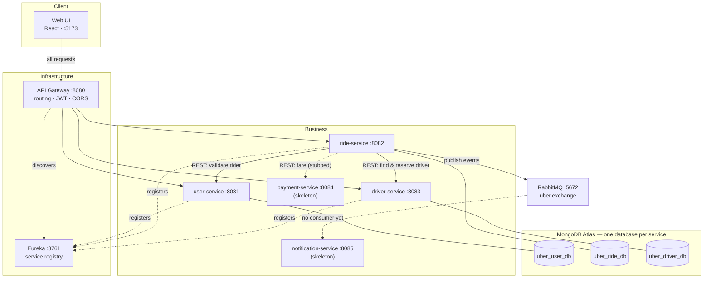
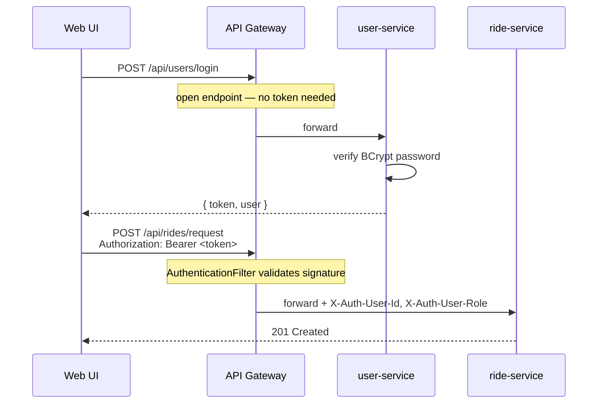
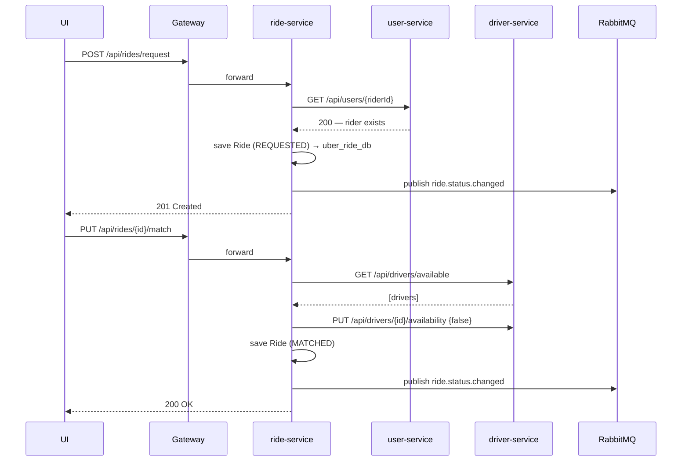

# System Design & Local Setup

A practical guide to what this system is, how the pieces talk to each other, and
how to run the whole thing on your machine.

---

# Part 1 — Running It Locally

## What you need first

| Requirement | Notes |
|---|---|
| **Java 21** | Not 25. Lombok 1.18.46 silently fails to generate getters/setters on JDK 25, and the build dies with hundreds of "cannot find symbol" errors |
| **Maven** | Or IntelliJ's bundled Maven |
| **Node.js 20+** | For the web UI |
| **Docker** | Runs RabbitMQ |
| **MongoDB Atlas account** | The cluster is cloud-hosted; you need credentials |

If `java -version` shows 25, point Maven at 21 before building:

```bash
export JAVA_HOME=$(/usr/libexec/java_home -v 21)
```

## Step 1 — Database credentials

```bash
cp .env.example .env
```

Fill in your Atlas username and password:

```properties
MONGO_DB_USER=your_atlas_username
MONGO_DB_PASS=your_atlas_password
```

Every service reads this same root `.env` via
`spring.config.import: optional:file:.env[.properties],optional:file:../.env[.properties]`.
The file is git-ignored, so credentials never get committed.

## Step 2 — Start RabbitMQ

```bash
docker compose up -d
```

This starts the broker on `5672` and a management UI on
<http://localhost:15672> (login `guest` / `guest`). `ride-service` will refuse
to boot without it, because Spring AMQP connects eagerly at startup.

## Step 3 — Build the backend

```bash
mvn clean install
```

> If it fails with `cannot find symbol: method getXxx()` everywhere, you're on
> the wrong JDK. See the `JAVA_HOME` note above.

## Step 4 — Start the services, in order

Order matters: Eureka must exist before anything can register, and the gateway
needs the registry before it can route.

| # | Service | Port | Start with |
|---|---|---|---|
| 1 | `eureka-server` | 8761 | `mvn spring-boot:run -pl eureka-server` |
| 2 | `api-gateway` | 8080 | `mvn spring-boot:run -pl api-gateway` |
| 3 | `user-service` | 8081 | `mvn spring-boot:run -pl user-service` |
| 4 | `driver-service` | 8083 | `mvn spring-boot:run -pl driver-service` |
| 5 | `ride-service` | 8082 | `mvn spring-boot:run -pl ride-service` |

Or just run each `*Application.java` from IntelliJ.

> **Wait ~30 seconds after starting the gateway.** It pulls the service registry
> from Eureka on a timer. Send a request too early and you get `503 Service
> Unavailable` — this is expected, not a bug.

Check <http://localhost:8761> — you should see `API-GATEWAY`, `USER-SERVICE`,
`DRIVER-SERVICE` and `RIDE-SERVICE` registered.

`payment-service` (8084) and `notification-service` (8085) are empty skeletons.
Starting them does nothing useful; skipping them changes nothing.

## Step 5 — Start the web UI

```bash
cd web
npm install
npm run dev
```

Open <http://localhost:5173>. If that port is taken Vite moves to 5174 — that
still works, because the gateway accepts any `localhost` port.

Register a rider in one browser, a driver in another (a private window works),
and you can drive a ride end to end.

## Testing without the UI

`requests/*.http` are IntelliJ HTTP Client files covering every endpoint,
including error cases. `ride.http` hits services directly; `ride_api-gateway.http`
goes through the gateway and handles the JWT login for you.

---

# Part 2 — System Design

## The shape of it



## Who owns what

Each service owns one business capability and one database. Nothing else may
touch that database.

| Service | Owns | Database |
|---|---|---|
| **user-service** | Identity: accounts, passwords, roles, JWT issuance | `uber_user_db` |
| **ride-service** | The ride lifecycle and its state machine | `uber_ride_db` |
| **driver-service** | Driver profiles, vehicles, availability, location | `uber_driver_db` |
| **payment-service** | Fares and transactions *(not built)* | `uber_payment_db` |
| **notification-service** | Notification delivery *(not built)* | `uber_notification_db` |

## Inside a single service

Every service follows the same four layers. It's deliberately plain — no
service interfaces, no factories, no mappers library.

```
Controller   REST endpoints. Thin: validate shape, delegate, wrap in ResponseEntity
    ↓
Service      All business logic. Talks to other services. Publishes events
    ↓
Repository   Spring Data MongoRepository. Derived query methods only
    ↓
Model        @Document entity
```

Two rules hold everywhere:

- **Entities never leave the service.** Controllers return `*Response` DTOs, so
  internals (like the BCrypt password hash) can't leak by accident.
- **Errors are uniform.** A `@RestControllerAdvice` in each service turns
  `ResourceNotFoundException` → 404, `DuplicateResourceException` → 409,
  `InvalidStateException` → 409 and `IllegalArgumentException` → 400, all with
  the same JSON body:

```json
{ "timestamp": "...", "status": 404, "error": "Not Found", "message": "Ride not found with id: abc" }
```

Because the shape is identical everywhere, the UI has exactly one error parser.

---

## The important question: database per service

**Yes — strictly.** Five services, five separate databases. No service holds
connection details for any database but its own; you can verify this by
grepping the `application.yml` files.

### So how does one service use another's data?

**It doesn't read the other database. It asks the owning service.** There is no
shared schema, no cross-database join, and no foreign key between databases.
Three mechanisms cover every case:

#### 1. Synchronous REST through service discovery

When `ride-service` needs to confirm a rider exists, it calls user-service's
API — using the *logical service name*, not a hostname or port:

```java
restTemplate.getForEntity("http://user-service/api/users/{id}", Map.class, userId);
```

`user-service` is not a DNS name. A `@LoadBalanced` RestTemplate intercepts the
call, asks Eureka where `USER-SERVICE` currently lives, and rewrites the URL to
a real address. Move the service to another port or run three copies, and
nothing in the calling code changes.

> This is why every service needs `spring-cloud-starter-loadbalancer`. Without
> it, Java tries to resolve `user-service` as a real hostname and throws
> `UnknownHostException`.

#### 2. Store the foreign ID, nothing else

A `Ride` references people by id only:

```java
private String riderId;    // lives in uber_user_db
private String driverId;   // lives in uber_user_db + uber_driver_db
```

No copied name, phone or vehicle. Those are fetched from the owner when needed.
The cost is an extra network call; the benefit is that a rider changing their
phone number doesn't leave stale copies scattered across three databases.

#### 3. API composition in the UI

Some views need data from several services at once. Rather than building a
backend endpoint that reaches across boundaries, the UI fetches from each owner
and composes the result. The driver card on the rider's tracking screen is
exactly this:

```
GET /api/users/{driverId}     → name, phone      (user-service)
GET /api/drivers/{driverId}   → vehicle, plate   (driver-service)
                              ↓
                     one card in the UI
```

### The trade-off, stated honestly

This buys independence — each service can change its schema without
coordinating — and costs consistency. There are **no distributed transactions**.
`ride-service` handles multi-step operations by hand, including the compensating
step of releasing a reserved driver when a ride is cancelled.

That handling isn't bulletproof. In `matchDriver`, the driver is marked
unavailable *before* the ride is saved; if the save then fails, the driver is
left reserved for a ride that doesn't exist. A production system would need a
saga with proper compensation, or an outbox. For a course project, the failure
window is acknowledged rather than engineered away.

---

## How a request actually flows

### Authentication happens once, at the edge



`user-service` signs a 24-hour HS256 JWT carrying the user id as `sub` and the
role as a claim. The gateway validates it on every request except
`/api/users/register` and `/api/users/login`, then injects `X-Auth-User-Id` and
`X-Auth-User-Role` headers downstream.

**Downstream services trust those headers and do not re-validate the token.**
That keeps the services simple, and it means the gateway is the only security
boundary — anyone who can reach `:8081` directly bypasses authentication
entirely. Acceptable when only the gateway is exposed; a real deployment would
keep service ports off the public network.

### Requesting a ride, step by step



`ride-service` is the **orchestrator**: it holds the sequence and calls the
others in turn. The alternative — choreography, where each service reacts to
events — would scatter the ride lifecycle across five codebases. For a state
machine this central, one owner is easier to reason about.

### The ride state machine

```
REQUESTED ──match──> MATCHED ──start──> IN_PROGRESS ──complete──> COMPLETED
    │                   │                    │
    └───────────────────┴────────────────────┴──cancel──> CANCELLED
```

Transitions are enforced in `RideService`, not the controller. Completing a ride
that was never started throws `InvalidStateException` → 409, which the UI shows
as a readable sentence. Keeping the rules in one class means every entry point
gets the same guarantees.

---

## Communication: two styles, chosen deliberately

| | Synchronous REST | Asynchronous events |
|---|---|---|
| **Used for** | Queries and commands needing an answer | Notifying that something happened |
| **Transport** | `RestTemplate` + Eureka discovery | RabbitMQ topic exchange |
| **Example** | "Does this rider exist?" | "This ride became MATCHED" |
| **If the other side is down** | Call fails, request fails | Message waits in the queue |

The rule: **if the caller needs the answer to continue, use REST; if it's just
announcing a fact, publish an event.** Validating a rider must be synchronous —
there's no point creating a ride for someone who doesn't exist. Telling someone
their ride was matched must not be, because a notification outage shouldn't
block rides.

### The event setup

`ride-service` publishes to a topic exchange on every status change:

| Component | Value |
|---|---|
| Exchange | `uber.exchange` (topic) |
| Routing key | `ride.status.changed` |
| Queue | `ride.status.queue` |
| Payload | `RideStatusChangedEvent` — rideId, riderId, driverId, status, message, timestamp |
| Consumer | none yet — `notification-service` is a skeleton |

Messages are serialised as JSON rather than Java objects, so a future consumer
isn't forced to share the publisher's classes. Events are published and queued
today; with no consumer running they simply accumulate in `ride.status.queue`,
which you can watch in the RabbitMQ management UI.

---

## Patterns used, and why

| Pattern | Where | Why |
|---|---|---|
| **API Gateway** | `api-gateway` | One entry point, so the UI needs one URL and clients never learn the internal topology |
| **Service Registry** | Eureka + LoadBalancer | Services find each other by name, so ports and instance counts can change freely |
| **Database per Service** | 5 Mongo databases | Independent schemas; no service can corrupt another's data |
| **Layered architecture** | Every service | Same four layers everywhere, so any service is readable once you've read one |
| **DTO at the boundary** | Every controller | Entities never escape; passwords can't leak |
| **Centralised error handling** | `GlobalExceptionHandler` | One error shape across all services means one parser in the UI |
| **Edge authentication** | Gateway filter | Auth logic exists once, not five times |
| **Orchestration** | `ride-service` | The ride lifecycle has one owner instead of being spread across services |
| **Async messaging** | RabbitMQ | Notifications can never block or fail a ride |
| **API composition** | Web UI | Cross-service views without violating ownership |
| **Referencing by ID** | `Ride.riderId`, `driverId` | No duplicated data, therefore no stale copies |

## What's deliberately not built

Being explicit about this matters more than pretending completeness.

| Gap | Effect |
|---|---|
| `payment-service` is a skeleton | Fares are a flat `50.0` placeholder. `ride-service.processPayment()` is a documented stub that skips the call and copies the estimate to `finalFare` |
| `notification-service` is a skeleton | Events are published but nothing consumes them |
| No driver accept/reject | Matching is rider-triggered and auto-picks the first available driver. There is no endpoint for a driver to accept or decline |
| No retries or circuit breakers | One slow dependency directly slows the caller; there's no Resilience4j |
| No real-time push | The UI polls: 4s for an active ride, 5s for the driver dashboard, 10s for admin tables |
| No geospatial matching | `pickupLocation` is free text. `driver-service` has a bounding-box `/nearby` endpoint, but the ride flow doesn't use it |
| No service-to-service auth | Services trust the gateway's headers unconditionally |
| No input validation annotations | No `@Valid` / `@NotBlank`; validation is manual and minimal |

## A note on the Eureka config

`eureka-server/application.yml` sets `register-with-eureka: true` and
`fetch-registry: true` while the inline comments say the opposite ("Server
doesn't register itself"). For a single standalone registry these are normally
`false`. It works as-is — the server just registers with itself — but the
comments and the values disagree, which is worth tidying if it ever causes
confusion in the logs.

---

## Quick reference

| Thing | Where |
|---|---|
| Eureka dashboard | <http://localhost:8761> |
| RabbitMQ UI | <http://localhost:15672> (`guest`/`guest`) |
| Gateway | <http://localhost:8080> |
| Web UI | <http://localhost:5173> |
| Route mapping | `/api/users/**` · `/api/rides/**` · `/api/drivers/**` → matching service |
| Per-service docs | `docs/user-service-doc.md`, `docs/driver-service-doc.md`, `docs/ride-service-doc.md`, `docs/api-gateway-doc.md` |
| Full design report | `docs/report.md` |
